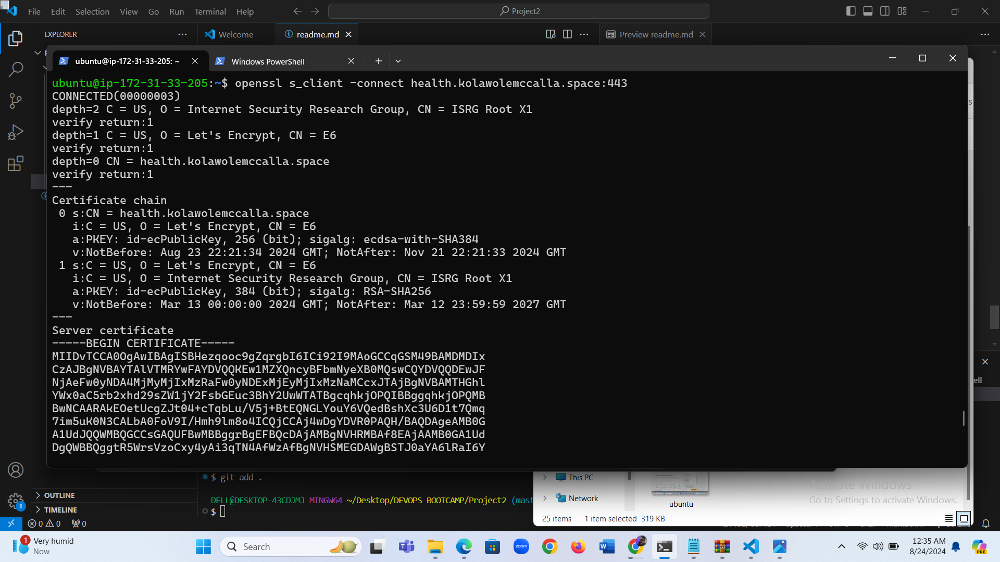

## Project Title : Setup Multiple Static Websites on a Single Server Using Nginx Virtual Hosts

I Spined up my ubuntu server, and created an elastic IP and associated it to my instance.
## I Installed Nginx and Setup my Website
I Executed the following commands.

sudo apt update

sudo apt upgrade

sudo apt install nginx

I Started my Nginx server by running the sudo systemctl start nginx command, enabled it to start on boot by executing sudo systemctl enable nginx, and then confirmed if it's running with the sudo systemctl status nginx command.

I Visited my instances IP address in a web browser to view the default Nginx startup page.

I Downloaded my website template from my preferred website by navigating to the website, locating the template i want.

I Right clicked and selected Inspect from the drop down menu.

I Clicked on the Network tab and then clicked Download button.

I Right clicked on the website name, selected Copy and clicked on Copy link address.

To install the unzip tool, i ran the following command: sudo apt install unzip.

I Executed the command to download and unzip my website files sudo curl -o /var/www/html/2098_health.zip https://www.tooplate.com/zip-templates/2098_health.zip && sudo unzip -d /var/www/html/ /var/www/html/2098_health.zip && sudo rm -f /var/www/html/2098_health.zip.

I Downloaded the 2nd website template by running the following command:
sudo curl -o /var/www/html/2106_soft_landing.zip https://www.tooplate.com/zip-templates/2106_soft_landing.zip && sudo unzip -d /var/www/html/ /var/www/html/2106_soft_landing.zip && sudo rm -f /var/www/html/2106_soft_landing.zip

Note

I Replaced the placeholders in the code with my own website URL.

To set up my website's configuration, I started by creating a new file in the Nginx sites-available directory. I Used the following command to open a blank file in a text editor: sudo nano /etc/nginx/sites-available/cleaning

I Copied and pasted the following code into the open text editor.

server {
    listen 80;
    server_name health.kolawolemccalla.space www.health.kolawolemccalla.space;

    root /var/www/html/example.com;
    index index.html;

    location / {
        try_files $uri $uri/ =404;
    }
}

I Configured my second website by creating a new file in the Nginx sites-available directory with the following command: sudo nano /etc/nginx/sites-available/soft_landing.
7

I Copied and pasted the following code into the open text editor.

server {
    listen 80;
    server_name softlanding.kolawolemccalla.space www.softlanding.kolawolemccalla.space;

    root /var/www/html/placeholder.com;
    index index.html;

    location / {
        try_files $uri $uri/ =404;
    }
}

I created a symbolic link for both websites by running the following command. sudo ln -s /etc/nginx/sites-available/cleaning /etc/nginx/sites-enabled/ sudo ln -s /etc/nginx/sites-available/health /etc/nginx/sites-enabled/

i run the sudo nginx -t command to check the syntax of the Nginx configuration file.

I deleted the default files in the sites-available and sites-enabled directories by executing the following commands:

sudo rm /etc/nginx/sites-available/default
sudo rm /etc/nginx/sites-enabled/default

### I restarted the Nginx server by executing the following command: sudo systemctl restart nginx.
## I created An A Record

To make my website accessible via my domain name rather than the IP address, i set up a DNS record. I did this by buying my domain from domain.com and then moving hosting to AWS Route 53, where I set up an A record.

In route 53, I selectd the domain name and clicked on Create record.

Paste your IP address and then click on Create records②.

I clicked on Create record again, to create the record for your sub domain.

I inputed the Record name①, I pasted my IP address② and then clicked on Create records③.

I Repeated the same process while creating my second subdomain record, and confirmed that they both exist in the records list.

I opened my terminal and run sudo nano /etc/nginx/sites-available/cleaning to edit your settings. I entered the name of my domain and then saved my settings.

I run sudo nano /etc/nginx/sites-available/health to edit my settings. I entered the name of my domain and then saved my settings.

I restarted my nginx server by running the sudo systemctl restart nginx command.

I went to my domain name in a web browser to verify that my website is accessible.

### I installed certbot and Requested For an SSL/TLS Certificate
I installed certbot by executing the following commands: sudo apt update sudo apt install python3-certbot-nginx sudo certbot --nginx

I executed the sudo certbot --nginx command to request my certificate. I followed the instructions provided by certbot and selected the domain name for which i would like to activate HTTPS.
20

Verify the website's SSL using the OpenSSL utility with the command: openssl s_client -connect health.kolawolemccalla.space:443

I visited https://<health.kolawolemccalla.space> to view my websites.

The End Of Project 2
