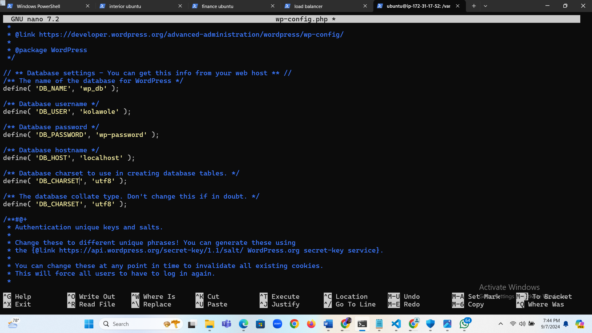

## PROJECT TITLE: Setup WordPress Website Using LAMP Stack
1. Firstly i spinned up my Ubuntu server.

2. I set an inbound rule for MYSQL in my security group. I clicked on Security and selected the Security group.

3. I clicked on Edit inbound rules.

4. I clicked on Add rule.

5. I clicked on Custom TCP and selected MySQL/Aurora.

6. I then entered the IP address i want to allow access and clicked Save rules.

7. I opened my terminal and connected to my Ubuntu server via SSH.

## To install Apache
To install Apache, i ran the following commands in my terminal.

sudo apt update

sudo apt install apache2

8. To enable Apache to start on boot, I executed sudo systemctl enable apache2, and then i verified its status with the sudo systemctl status apache2 command.

9. I executed the following command: curl http://localhost:80. to check if the server is accessible and running both locally and from the interet

10. I Copied my public IPv4 address from my EC2 dashboard.

11. I opened a web browser and tried accessing the following URL: http://54.159.41.91:80

## To install MYSQL
12. To install this software using 'apt', I ran the command sudo apt install mysql-server. When prompted, I confirmed the installation by typing 'Y' and then pressing ENTER.

13. After the installation was complete, I logged in to the MySQL console by typing: sudo mysql.

14. I ran the following command to set the password for the root user with the MySQL native password authentication method: ALTER USER 'root'@'localhost' IDENTIFIED WITH mysql_native_password BY 'pass';. I exited the MySQL shell when i was done by typing exit.

15. I started the interactive script by running: sudo mysql_secure_installation. I answer y for yes, or any other key to continue without enabling specific options.

16. I Set up my password validation policy level.

17. I enabled MySQL to start on boot by executing sudo systemctl enable mysql, and then i confirmed its status with the sudo systemctl status mysql command.

## To Install PHP

18. I installed PHP along with required extensions by running the following script: sudo apt install php-curl php-gd php-mbstring php-xml php-xmlrpc php-soap php-intl php-zip.

19. I ran sudo apt install php libapache2-mod-php php-mysql

20. I confirmed the downloaded PHP version by running php -v.

## Creating A Virtual Host For My Website Using Apache
21. I created the directory for Projectlamp using the 'mkdir' command as follows: sudo mkdir /var/www/projectlamp and assign ownership of the directory to our current system user using: sudo chown -R $USER:$USER /var/www/projectlamp.

22. I created and opened a new configuration file in Apache's sites-available directory using your preferred command-line editor: sudo vi /etc/apache2/sites-available/projectlamp.conf.

23. Creating this will produce a new blank file. Paste the configuration text provided below into it:

<VirtualHost *:80>

ServerName projectlamp

ServerAlias www.projectlamp

ServerAdmin webmaster@localhost

DocumentRoot /var/www/projectlamp

ErrorLog ${APACHE_LOG_DIR}/error.log

CustomLog ${APACHE_LOG_DIR}/access.log combined

</VirtualHost>

24. I saved my changes by pressing the Esc key, then i typed :wq and pressed enter.

25. I ran the ls command sudo ls /etc/apache2/sites-available to show the new file in the sites-available directory.

26. I then enabled the new virtual host using the a2ensite command: sudo a2ensite projectlamp.

27. To disable Apache's default website, I used the a2dissite command. and Typed: sudo a2dissite 000-default.

28. To ensure my configuration file doesn’t contain syntax errors, i ran: sudo apache2ctl configtest. I saw "Syntax OK" in the output if my configuration is correct.

29. Finally i ran: sudo systemctl reload apache2. This will reload Apache for the changes to take effect.

30. To create the index.html file with the content "Hello LAMP from mccalla" in the /var/www/projectlamp directory, I used the following command: sudo echo 'Hello LAMP from mccalla' > /var/www/projectlamp/index.html.

31. I opened my web browser and tred to access my website using the IP address:
http://54.159.41.91:80

32. I removed the index.html file by running the following command: sudo rm /var/www/projectlamp/index.html 
## To enable PHP On The Website
With the default DirectoryIndex settings on Apache, a file named index.html will always take precedence over an index.php file. To change the precedence of index files (such as index.php over index.html) in Apache, i edited the dir.conf file. by

33. Editing the dir.conf file using a text editor sudo nano /etc/apache2/mods-enabled/dir.conf

34. I looked for the DirectoryIndex directive within this file.

<IfModule mod_dir.c>
    DirectoryIndex index.html index.cgi index.pl index.php index.xhtml index.htm
</IfModule>
To prioritize index.php over index.html, i moved index.php to the beginning of the list, like this:
<IfModule mod_dir.c>
    DirectoryIndex index.php index.html index.cgi index.pl index.xhtml index.htm
</IfModule>

35. I reloaded Apache for the changes to take effect: sudo systemctl reload apache2.

Apache will prioritize index.php over index.html when both files exist in the same directory.

36. To create a new file named index.php inside my custom web root folder (/var/www/projectlamp), i can use the following command to open it in the nano text editor: nano /var/www/projectlamp/index.php.

37. This will create a new file. I Copied and pasted the following PHP code into the new file:

38. After saving and closing the file, i went back to my web browser and refreshed the page. I saw this:

39. After i verified the relevant information about my PHP server through that page, i removed the file i created, as it contains sensitive information about my PHP environment and my Ubuntu server. i used the rm command to do so: sudo rm /var/www/projectlamp/index.php.

## To install Wordpress
40. After setting up the LAMP environment, I started installing WordPress. Firstly, i downloaded the WordPress installation files and place them in the default web server root directory: /var/www/html.

41. I navigate to the directory using the cd command cd /var/www/html, and then downloaded the WordPress installation files using the following command: sudo wget -c http://wordpress.org/latest.tar.gz

42. I Extracted the files from the downloaded WordPress archive using the command: sudo tar -xzvf latest.tar.gz

43. I ran the command ls -l to confirm the existence of the wordpress directory in the current location (/var/www/html).

44. I checked the user running my web server with the command: ps aux | grep apache | grep -v grep.

45. I granted ownership of the WordPress directory and its files to the web server user (www-data) by running the command: sudo chown -R www-data:www-data /var/www/html/wordpress.

## To create a Database For Wordpress
46. I accessed my MySQL root account with the following command: sudo mysql -u root -p. Entered the password i setup earlier when prompted.

47. To create a separate database named wp_db for WordPress to manage, i executed the following command in the MySQL prompt: CREATE DATABASE wp_db;

48. To access the new database, i created a MySQL user account with a strong password using the following command: CREATE USER kolawole@localhost IDENTIFIED BY 'wp-password';

49. I replaced 'wp-password' with my preferred strong password for the MySQL user account.

50. To grant my created user (kolawole@localhost) all privileges needed to work with the wp_db database in MySQL, i used the following commands:

51. GRANT ALL PRIVILEGES ON wp_db.* TO kolawole@localhost;
FLUSH PRIVILEGES;

52. Type exit to exit the MySQL shell.

53. I granted executable permissions recursively (-R) to the wordpress folder using the following command: sudo chmod -R 777 wordpress/

54. I changed into the WordPress directory by running the command: cd wordpress.

## To configure Wordpress

55. I renamed the sample WordPress configuration file with the command: mv wp-config-sample.php wp-config.php.

56. Edited the wp-config.php file using the command: sudo nano wp-config.php.

57. I updated the database settings in the wp-config.php file by replacing placeholders like database_name_here, username_here, and password_here with your actual database details.

58. I modified the configuration file projectlamp.conf: sudo nano /etc/apache2/sites-available/projectlamp.conf to update the document root to the directory where my WordPress installation is located.

59. After updating the document root to /var/www/html directory in my editor, i saved the changes and exited.

60. I reloaded Apache for the changes to take effect: sudo systemctl reload apache2.

61. I access my WordPress page to complete the installation. by opening my web browser and go to http://54.159.41.91/wordpress/. This lead me to the WordPress setup wizard where i can finalize the installation process.

62. I selected my preferred language and then clicked on Continue to proceed.

63. I entered the required information and clicked on Install WordPress when i was done.

64. WordPress has been successfully installed. I then logged in to my admin dashboard using the previously set up information by clicking the Log In button.

65. I entered my username and password, then clicked Log In to access my WordPress admin dashboard.

66. I was greeted by the WordPress dashboard page when i successfully logged in.

## To create An A Record
67. I visited Project1 for instructions on how to create a hosted zone.

68. I Pointed my domain's DNS records to the IP addresses of my Apache load balancer server.

69. In route 53, i clicked on Create record.

70. I pasted my IP address and then clicked on Create records to create the root domain.

71. I clicked on Create record again, to create the record for my sub domain.

72. I pasted my IP address, input the Record name(www) and then clicked on Create records.

73. To update my Apache configuration file in the sites-available directory to point to my domain name, i used the command: sudo nano /etc/apache2/sites-available/projectlamp.conf.

74. I Ensured that the server settings in my Apache configuration is pointing to my domain name, and that the document root accurately points to my WordPress directory. 

<VirtualHost *:80>
    ServerName kolawolemccalla.space
    ServerAlias www.kolawolemccalla.space
    ServerAdmin webmaster@kolawolemcalla.space

    DocumentRoot /var/www/html/wordpress

    <Directory /var/www/html/wordpress>
        Options Indexes FollowSymLinks
       # AllowOverride All
        Require all granted
    </Directory>

    ErrorLog ${APACHE_LOG_DIR}/error.log
    CustomLog ${APACHE_LOG_DIR}/access.log combined
</VirtualHost>

75. To update my wp-config.php file with DNS settings,i used the following command: sudo nano wp-config.php and added these lines to the file:

76. I reloaded my Apache server to apply the changes with the command: sudo systemctl reload apache2, After reloading, i visited my website at http://kolawolemccalla.sapce to view my WordPress site.

77. To log in to my WordPress admin portal, i visited http://<domain name>/wp-admin, i entered my username and password, then clicked on log In. i then replace with my actual domain name.

78. Now that my WordPress site is successfully configured to use my domain name, the next step is to secure it by requesting an SSL/TLS certificate.

## To Install certbot and Request For an SSL/TLS Certificate
79. I installed certbot by executing the following commands: sudo apt update sudo apt install certbot python3-certbot-apache

80. I ran the command sudo certbot --apache to request my SSL/TLS certificate. Follow the instructions provided by Certbot to select the domain name for which you want to enable HTTPS.

81. i received a message confirming that the certificate has been successfully obtained.

82. I Visited my website to confirm, and i noticed that the "not secure" warning no longer appears, indicating that my site is now secure with HTTPS.

The End Of Project 4